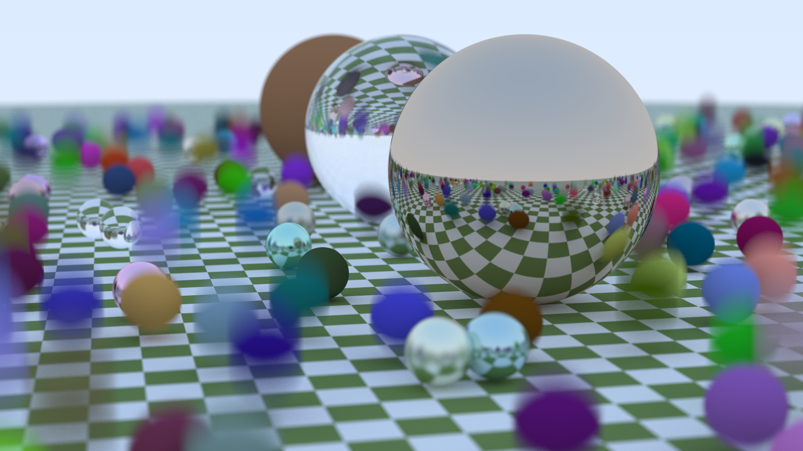
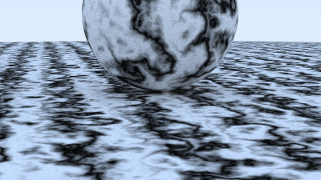
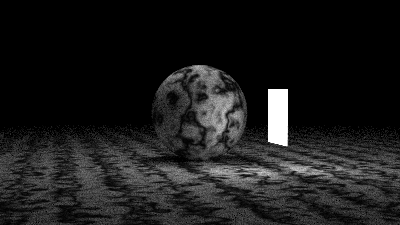
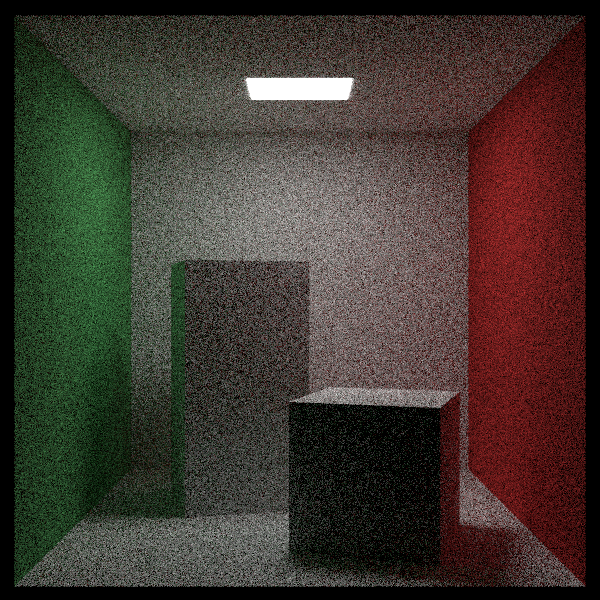

# rust-raytracing

A simple raytracer written in Rust as an excuse to learn Rust.

Mostly adapted from [Ray Tracing In One Weekend](https://raytracing.github.io/books/RayTracingInOneWeekend.html).

## How to run

The rendering parameters are defined in main.rs. You can give output file name as an argument, for example:

```
>cargo run -r -- image.png
```

## Examples










## Resources

Earth map from https://pxhere.com/en/photo/1025037