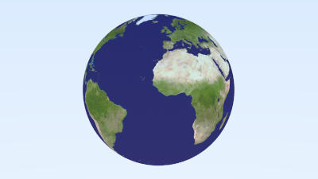

# rust-raytracing

A simple raytracer written in Rust as an excuse to learn Rust.

Mostly adapted from [Ray Tracing In One Weekend](https://raytracing.github.io/books/RayTracingInOneWeekend.html).

## How to run


### With Gui

```
cargo run -r
```

### Witout Gui

```
cargo run -r -- --no-gui --output <FILE> --scene <SCENE>
```

## Examples





## Resources

Earth map from https://pxhere.com/en/photo/1025037